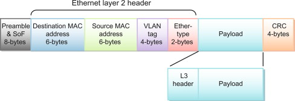

# Packet sniffer
This program is coded following the tutorial: [Youtube](https://www.youtube.com/playlist?list=PL6gx4Cwl9DGDdduy0IPDDHYnUx66Vc4ed)

## References  

- Ethernet frame:  
  

- IPv4 header:  

- IPv4 protocol ID: [Wikipedia](https://en.wikipedia.org/wiki/List_of_IP_protocol_numbers)
  - Protocols:
    - ICMP: [GeeksforGeeks](https://www.geeksforgeeks.org/internet-control-message-protocol-icmp/)
    - TCP: 